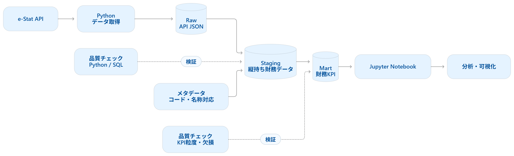
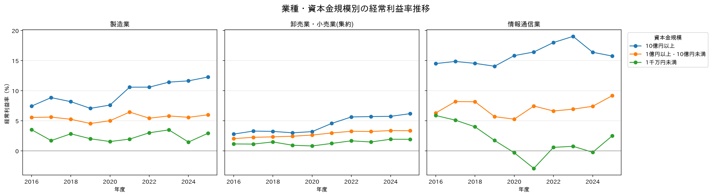
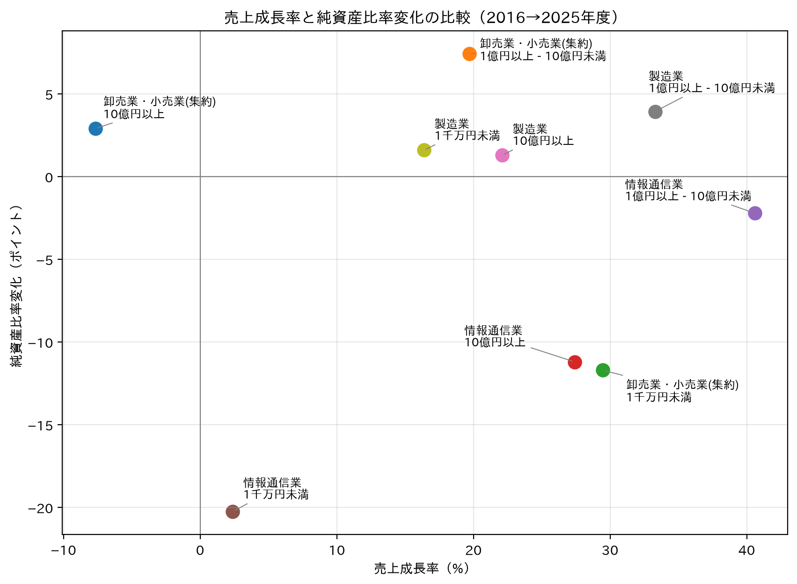

# 法人企業統計を用いた財務KPIデータ基盤
## このプロジェクトで実現したこと

- e-Stat APIから法人企業統計を取得し、BigQuery上にRaw・Staging・Martの`3層データ基盤を構築`
- 年度・業種・資本金規模別に、収益性・財務安全性・投資傾向を比較できる`財務KPIマートを作成`
- 540件の統計値を検証・整形し、90件の分析用KPIレコードへ変換

税務会計の実務経験を生かし、財務指標の定義、異常値の扱い、データ品質チェックを意識して設計しました。

## 1. プロジェクト概要

法人企業統計調査の集計データを対象に、以下のデータパイプラインを構築しました。<br>




## 2. 分析対象

- データソース: e-Stat 法人企業統計調査 時系列データ
- 対象年度: 2016〜2025年度
- 対象業種: 製造業、卸売業・小売業、情報通信業
- 資本金規模:
  - 1千万円未満
  - 1億円以上 - 10億円未満
  - 10億円以上

>対象とした財務項目は以下の6項目です。

- 資産合計
- 売上高
- 経常利益
- 従業員給与
- 実物投資
- 純資産

## 3. データ基盤の設計

BigQueryでは、用途ごとに3層のデータセットを作成しています。

| 層 | データセット | 役割 |
| --- | --- | --- |
| Raw | `corporate_finance_raw` | e-Stat APIレスポンスをJSON形式で保存 |
| Staging | `corporate_finance_staging` | JSONを展開し、分析可能な縦持ちデータへ整形 |
| Mart | `corporate_finance_mart` | 財務KPIを計算した分析用テーブル |

分析用マートの粒度は、`年度 × 業種 × 資本金規模` です。

## 4. 算出したKPI

| KPI | 計算式 | 意味 |
| --- | --- | --- |
| 経常利益率 | 経常利益 ÷ 売上高 × 100 | 本業・財務活動を含む収益性 |
| 純資産比率 | 純資産 ÷ 資産合計 × 100 | 資産に占める純資産の割合 |
| 人件費率 | 従業員給与 ÷ 売上高 × 100 | 売上に対する人件費の割合 |
| 実物投資比率 | 実物投資 ÷ 売上高 × 100 | 売上に対する設備等への投資規模 |
| 総資産経常利益率 | 経常利益 ÷ 資産合計 × 100 | 資産を用いた収益性 |

> 「純資産比率」は自己資本比率と完全に同義ではないため、本プロジェクトでは公表データの項目名に合わせて表記しています。

## 5. データ品質チェック

以下のチェックをPythonおよびBigQuery SQLで実装しました。

- 主キー（年度・業種・資本金規模・財務項目）の重複がないこと
- ディメンション項目・金額に欠損がないこと
- 全年度・全業種・全資本金規模の組み合わせが取得できていること
- 資産合計、売上高、従業員給与に不正な負数がないこと
- KPIマートの粒度が一意であること

経常利益・純資産・実物投資は会計上負の数になり得るため、一律に異常値として除外していません。

### 品質チェック結果

| チェック項目 | 結果 |
| --- | ---: |
| Stagingレコード数 | 540件 |
| KPIマートレコード数 | 90件 |
| 欠損値 | 0件 |
| 主キー重複 | 0件 |
| 不完全な組合せ | 0件 |
| KPIの欠損 | 0件 |

## 6. 分析
### 6-1. 分析目的

業種・資本金規模ごとに、売上成長、収益性、純資産比率の変化を比較し、
成長性と財務安全性が必ずしも一致しないケースを把握する。

### 6-2. 分析結果
#### 業種・資本金規模別の経常利益率推移



> 情報通信業では資本金規模別の収益性格差が大きく見られました。10億円以上の区分は高い経常利益率を維持する一方、1千万円未満の区分では2020〜2024年度に赤字となる年度があります。

#### 売上成長率と純資産比率変化



> 2016年度から2025年度にかけて、売上成長率と純資産比率の変化を比較しました。
> 
>- 製造業は、対象の全資本金規模で売上成長と純資産比率の改善が両立しています。
>- 情報通信業では、売上が伸びた区分でも純資産比率が低下したケースが見られます。
>- 情報通信業・1千万円未満は、純資産比率が約20ポイント低下しており、財務安全性の観点で注視すべき区分です。
>- 卸売業・小売業・10億円以上は、売上が減少した一方で純資産比率は改善しています。
> 

### 6-3. 分析上の注意点

- 本データは企業単位の個別の表ではなく、法人企業統計調査の集計データである。
- 対象表は金融業・保険業を含まない。
- 純資産比率は、集計された純資産を集計された資産合計で除して算出しており、個社比率の単純平均ではない。
- 本分析は記述的な比較であり、業種や資本金規模がKPIへ与える因果効果を示すものではない。


## 7. 使用技術

- Python 3.12
- uv
- pandas
- requests
- python-dotenv
- JupyterLab
- matplotlib
- BigQuery
- Google Cloud SDK
- SQL
- e-Stat API

## 8. 実行方法

### セットアップ

```bash
uv sync
```

`.env` を作成し、以下を設定します。

```env
ESTAT_APP_ID=取得したe-StatアプリケーションID
GOOGLE_CLOUD_PROJECT=Google CloudプロジェクトID
BIGQUERY_LOCATION=asia-northeast1
```

### データ取得からマート作成まで

```bash
uv run python src/get_metadata.py
uv run python src/export_metadata_codes.py
uv run python src/extract.py
uv run python src/transform.py
uv run python src/quality_checks.py

uv run python src/setup_bigquery.py
uv run python src/load_raw_to_bigquery.py
uv run python src/run_staging_sql.py
uv run python src/run_quality_checks_bigquery.py
uv run python src/load_metadata_to_bigquery.py
uv run python src/run_dimensions_sql.py
uv run python src/run_mart_sql.py
uv run python src/run_mart_quality_checks.py
```

### 分析・可視化

```bash
uv run python src/run_analysis.py
uv run jupyter lab
```

Notebook:

```text
notebooks/01_financial_kpi_analysis.ipynb
```


## 9. 今後の改善案

- e-Stat APIからの定期取得・差分更新
- BigQuery上のテーブル更新履歴の管理
- dbtによるSQLモデル・テスト管理
- Looker Studioによるダッシュボード化
- 業種・資本金規模・年度の対象範囲拡張

## 10. データ出典

- [e-Stat 法人企業統計調査 時系列データ](https://www.e-stat.go.jp/dbview?sid=0003060791)
- [e-Stat API](https://www.e-stat.go.jp/api/)

